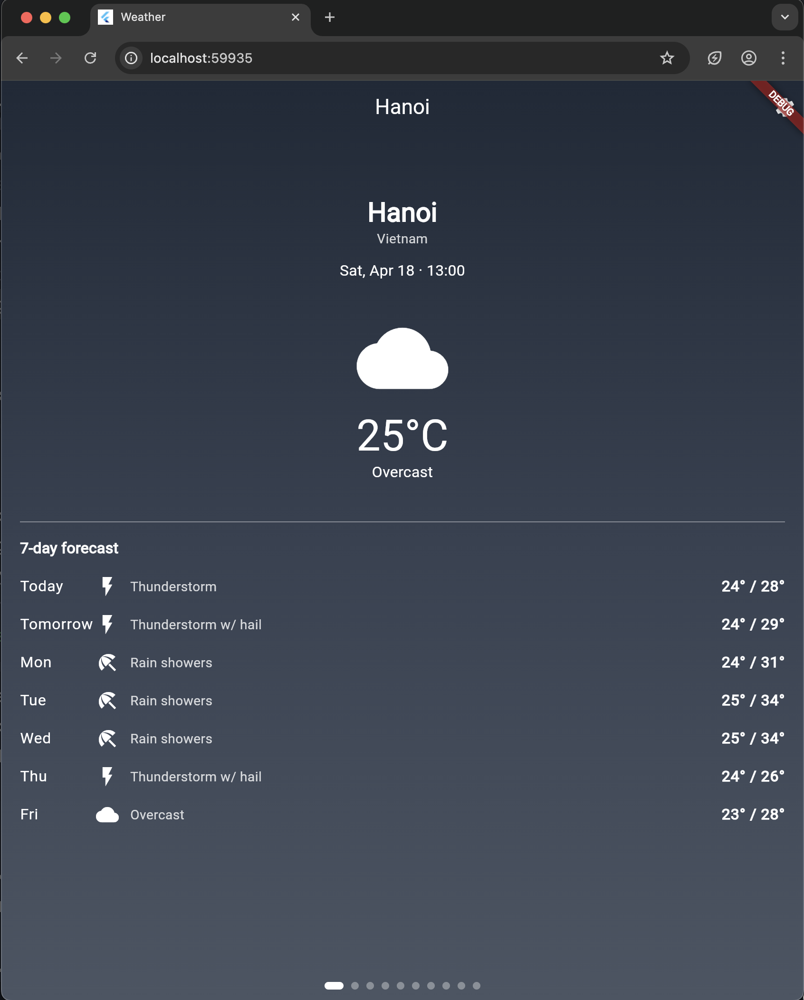
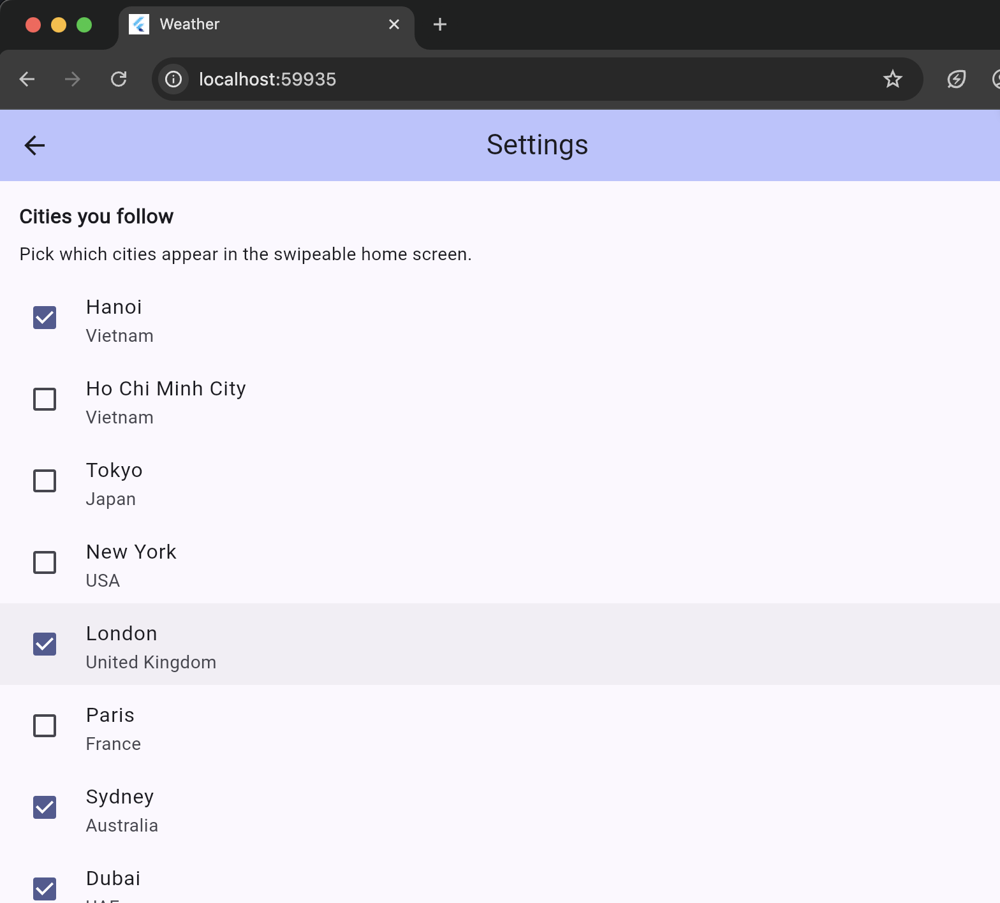

# Flutter Weather App

A simple Flutter weather app that tracks 10 world cities. Swipe between cities, see current temperature and a 7-day forecast, with backgrounds that adapt to the current weather and time of day.

## Demo

<p align="center">
  
</p>

<p align="center">
  
</p>

## Features

- Browse weather for 10 world cities: Hanoi, Ho Chi Minh City, Tokyo, New York, London, Paris, Sydney, Dubai, Singapore, San Francisco.
- Swipe left/right to move between cities (`PageView`), with animated page indicator dots.
- Per-city page shows current local time, current temperature (°C), a weather icon, and a 7-day forecast with min/max.
- Dynamic background gradients driven by the current WMO weather code **and** whether it's day or night at the city.
- Settings page with checkboxes to pick which cities appear on the home screen.
- Selections persist across app restarts via `SharedPreferencesAsync`.
- Pull-to-refresh on each city page.

## Tech stack

- **Flutter** (Material 3)
- **[Open-Meteo](https://open-meteo.com/)** — free weather API, no key required
- **http** — HTTP client
- **shared_preferences** — persistence (`SharedPreferencesAsync`, the modern replacement for the legacy `getInstance()` API)

## Getting started

Prerequisites: a working Flutter SDK (see [Flutter install guide](https://docs.flutter.dev/get-started/install)) and a device or emulator.

```bash
# Clone
git clone git@github.com:anhbkpro/flutter_weather_app.git
cd flutter_weather_app

# Install dependencies
flutter pub get

# Run
flutter run
```

## Project structure

```
lib/
├── main.dart                          # App entry point
├── models/
│   ├── city.dart                      # City model + catalog of 10 cities
│   └── weather.dart                   # WeatherData + DailyForecast + WMO code → label
├── services/
│   ├── weather_service.dart           # Open-Meteo API client
│   └── preferences_service.dart       # SharedPreferencesAsync wrapper
├── screens/
│   ├── home_screen.dart               # Swipeable PageView + page indicator
│   ├── weather_page.dart              # Single-city weather view
│   └── settings_screen.dart           # City selection checkboxes
└── widgets/
    ├── weather_background.dart        # Gradient palette by weather + day/night
    └── weather_icon.dart              # WMO code → Material icon
```

## How the background adapts

The background of each city page is a `LinearGradient` picked from a palette keyed on two inputs:

1. **Weather code group** — derived from the Open-Meteo WMO code: clear, partly cloudy, overcast, fog, rain, snow, or thunderstorm.
2. **Daylight flag** — `is_day` field returned by Open-Meteo (accounts for actual sunrise/sunset at the city, not a fixed 6 AM – 6 PM heuristic).

White text + icons are used across all palettes, with gradients chosen dark enough to keep everything readable.

## Data source

Weather data comes from [Open-Meteo](https://open-meteo.com/), which offers a free forecast API that doesn't require an API key. The app requests `current` (temperature, weather code, is_day) and `daily` (min/max temperature, weather code) over a 7-day window in the city's local timezone.

## License

MIT
